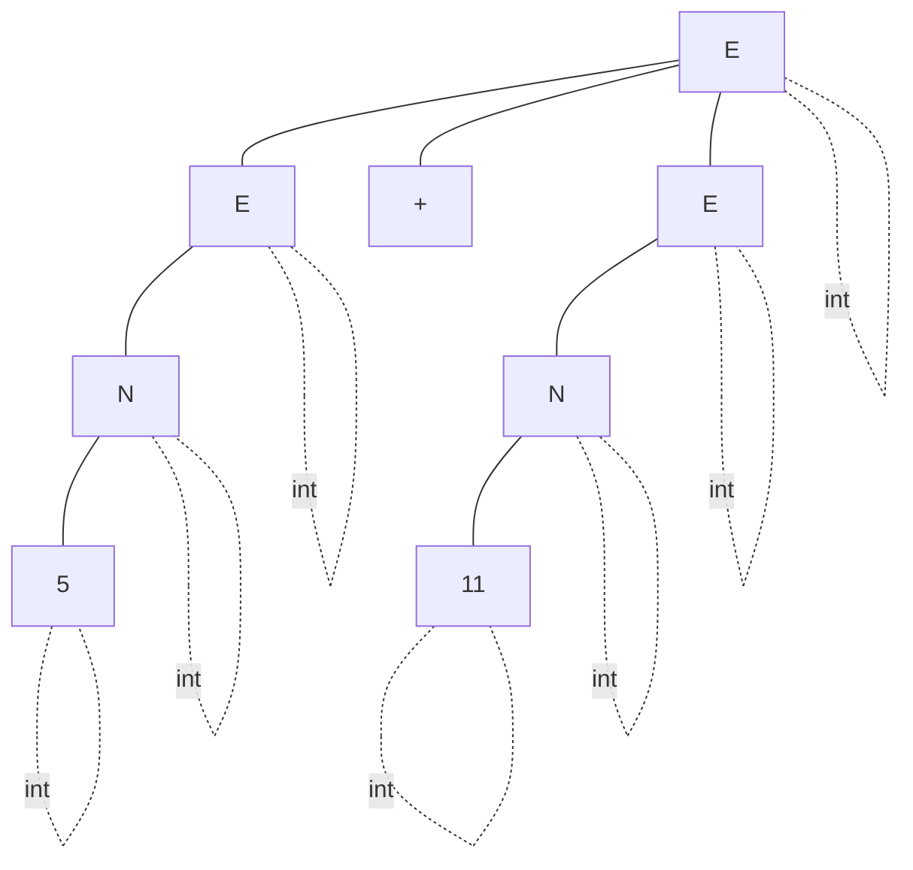
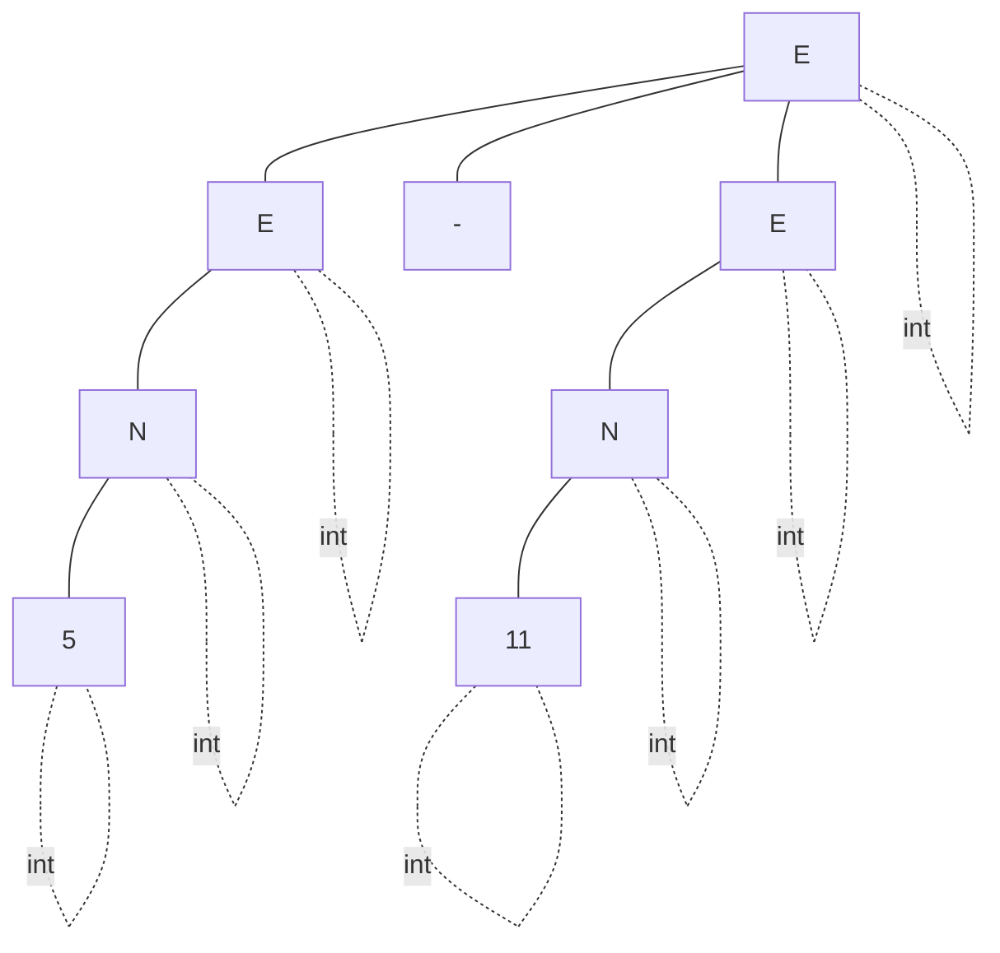
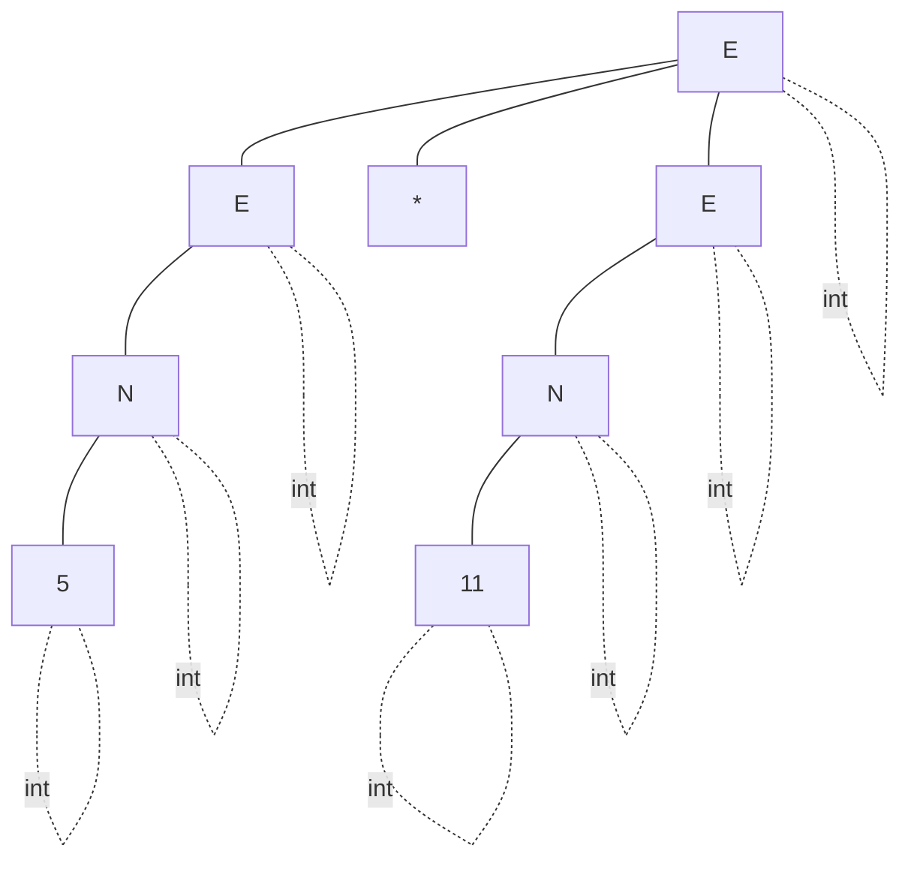
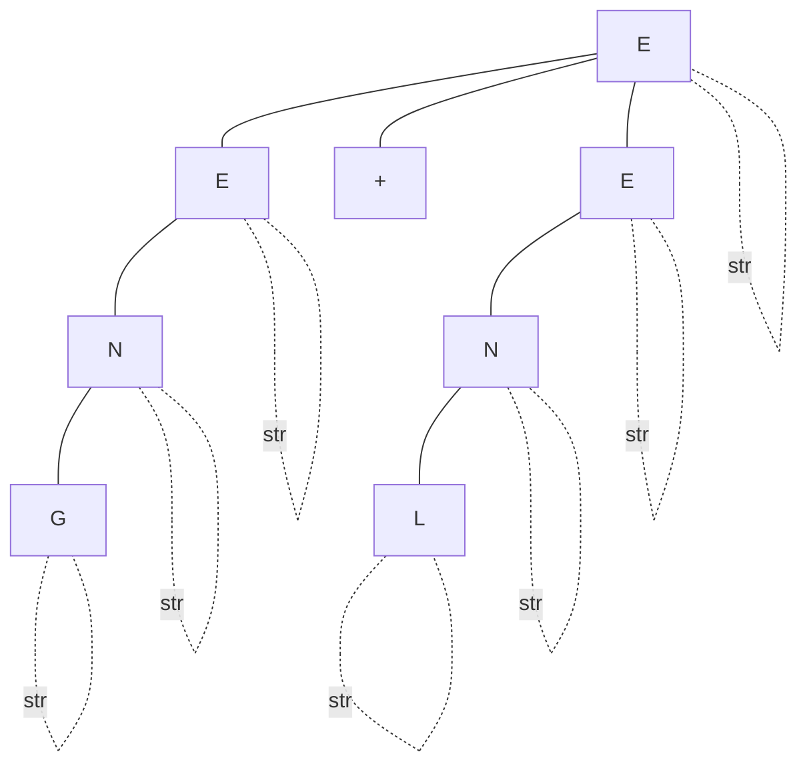
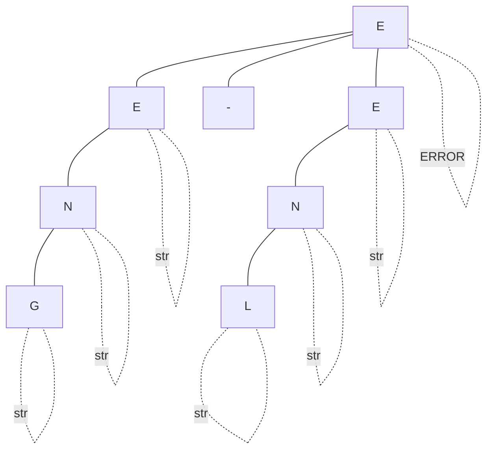
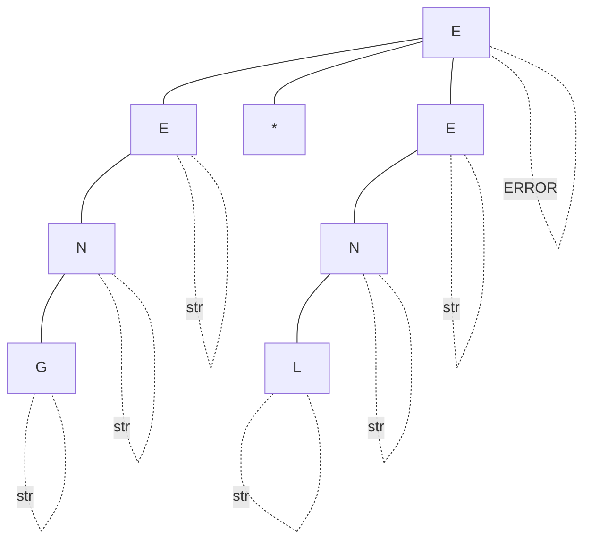
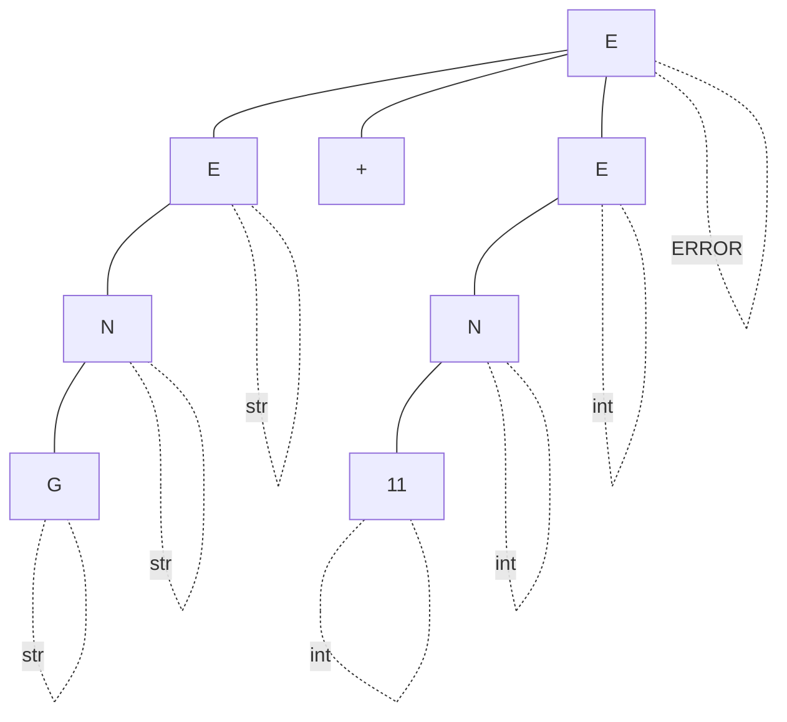
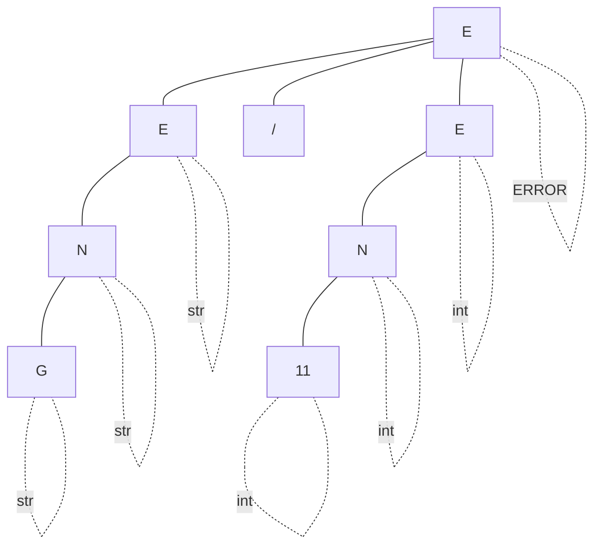
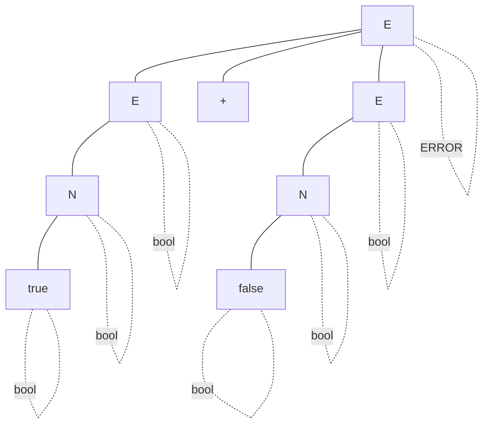
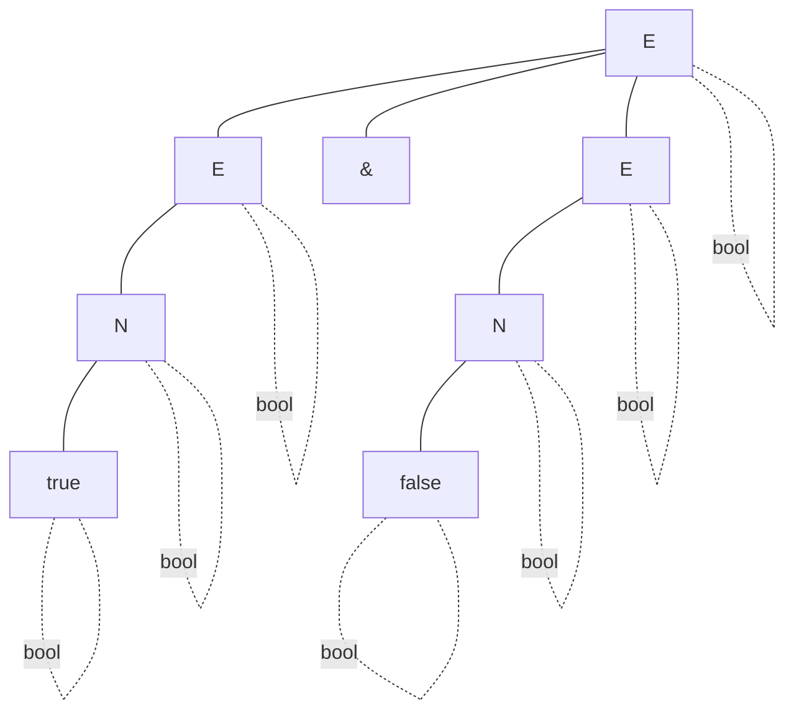

# Sistema de Tipos
Ø (): (En cualquier ámbito, en el ámbito global) 
Γ (Gamma): ambito (En un ámbito en particular) 
⊢ (Trinquete): a la derecha del trinquete es estrictamente verdadero  

Γ ⊢ M : A   
M: Variable   
A: Tipo de dato     

En el ambito gamma es estrictamente verdadero que la variable M es de tipo A.  

## Tipos de datos
* int: 
    * $Ø ⊢ [0-9]: int$
* string:
    * $Ø ⊢ "[a-zA-Z0-9]": str$
* bool: 
    * $Ø ⊢ true: bool$
    * $Ø ⊢ false: bool$

## Reglas de ámbito
Ámbito estático ya que se realiza un análisis de programa fuente de manera estática y no en tiempo ejecución.

## Reglas de tipos
### Operaciones entre int

$$
Γ ⊢ a: int \\
{Γ ⊢ b: int \over a + b: int}
$$

$$
Γ ⊢ a: int \\
{Γ ⊢ b: int \over a - b: int}
$$

$$
Γ ⊢ a: int \\
{Γ ⊢ b: int \over a * b: int}
$$

$$
Γ ⊢ a: int \\
{Γ ⊢ b: int \over a / b: int}
$$

 
 

### Operaciones entre string

$$
Γ ⊢ a: str \\
{Γ ⊢ b: str \over a + b: str}
$$

$$
Γ ⊢ a: str \\
{Γ ⊢ b: str \over a - b: ERROR}
$$

$$
Γ ⊢ a: str \\
{Γ ⊢ b: str \over a * b: ERROR}
$$

$$
Γ ⊢ a: str \\
{Γ ⊢ b: str \over a / b: ERROR}
$$

 
 

### Operaciones entre int y string
$$
Γ ⊢ a: str \\
{Γ ⊢ b: int \over a + b: ERROR}
$$

$$
Γ ⊢ a: str \\
{Γ ⊢ b: int \over a - b: ERROR}
$$

$$
Γ ⊢ a: str \\
{Γ ⊢ b: int \over a * b: str}
$$

$$
Γ ⊢ a: str \\
{Γ ⊢ b: int \over a / b: ERROR}
$$

### Operaciones entre bool

$$
Γ ⊢ a: bool \\
{Γ ⊢ b: bool \over a + b: ERROR}
$$

$$
Γ ⊢ a: bool \\
{Γ ⊢ b: bool \over a - b: ERROR}
$$

$$
Γ ⊢ a: bool \\
{Γ ⊢ b: bool \over a * b: ERROR}
$$

$$
Γ ⊢ a: bool \\
{Γ ⊢ b: bool \over a / b: ERROR}
$$

$$
Γ ⊢ a: bool \\
{Γ ⊢ b: bool \over a \& b: bool}
$$

$$
Γ ⊢ a: bool \\
{Γ ⊢ b: bool \over a | b: bool}
$$

* Suponemos que solo las variables y metodos tienen un scope o global o local
* Todos los metodos de una clase son globales